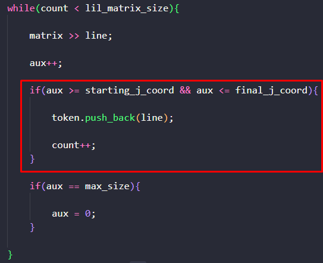
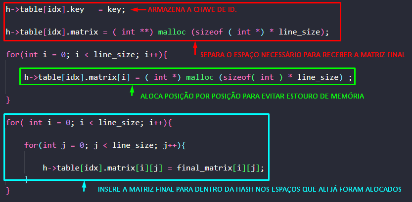
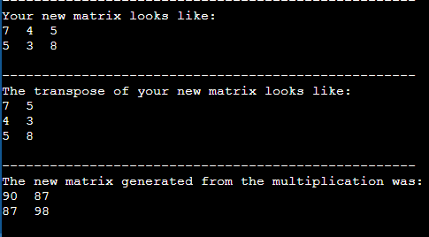
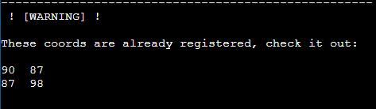

# MATRIX MANIPULATION

 

<h1>APRESENTAÇÃO 💡</h1>

Neste trabalho, cada aluno deve implementar um sistema de multiplicação de matrizes baseando-se em uma estratégia de segmentação em arquivo. Um arquivo 'M' grande chamado '<strong>matrix.txt</strong>' é fornecido no formato N x N com valores inteiros como entrada. Este é processado a partir de várias coordenadas introduzidas pelo usuário.

Após a leitura das coordenadas inseridas pelo usuário, o programa será capaz de "mapear" a matriz grande, recortando apenas o pedaço envolto pelas coordenadas inseridas. Com isso, deve ser calculado a transposta dessa matriz menor e realizar uma multiplicação da matriz recortada com sua transposta. A matriz resultante dessa multiplicação deve ser armazenada na <b>Hash</b>, assim como as coordenadas inseridas pelo usuário, que servirão como chave para esta posição na hash. Assim, para cada novo calculo, antes o sistema deve consular a hash para identificar se a multiplicação já foi realizada. Em caso afirmativo, retorne apenas a resposta já calculada. Caso contrário, elabore a multiplicação e armazene o conteúdo em cache.

 

<h1>INTRODUÇÃO 📌</h1>

Uma matriz é uma estrutura de dados com duas dimensões (i, j) organizada respectivamente em linhas e colunas. A primeira posição da matriz, (matriz[ 0 ][ 0 ]) se encontra sempre no canto superior esquerdo, enquanto a última posição, (matriz[ i ][ j ]) no canto inferior direito. Essa notação mostra que, no caso da <b>primeira</b> posição, se encontra no começo da Linha 0 com a Coluna 0, por isso [ 0 ][ 0 ], enquanto na <b>última posição</b>, ambas já atingiram seu tamanho máximo, digitado pelo ususário. No caso desse algoritmo, apenas trabalharemos com matrizes quadradas, onde o número de linhas é igual ao de colunas. 

 
<h1>LÓGICA UTILIZADA 📄</h1>

<h2>PRIMEIROS PASSOS 👣</h2>

Assim que o programa é iniciado, na página main é declarada e incializada a hash junto com um <i>int </i>M, o qual leva consigo o tamanho máximo da hash. O usuário então terá de entrar com o tamanho de sua matriz. Considerando que este programa irá funcionar apenas para matrizes <b>quadradas</b>, a entrada será apenas o número ou linhas, ou de colunas nas quais formam a matriz presente no arquivo. Sobre o arquivo, assim como já dito, seu nome tem de ser padrão para que o algoritmo funcione de maneira correta. O arquivo de nome '<code>matrix.txt</code>', deve conter apenas a matriz e cada elemento deve ser separado por um espaço. A figura 1 exemplifica como deve ser escrita a matriz dentro do arquivo para o funcionamento correto do programa.

<i>Figura 1: Exemplo de como a matriz deve estar dentrodo arquivo.</i>

Tendo inserido então o tamanho da matriz, um menu de opções aparecerá na tela do usuário. A primeira opção, caso so usuário digite '1', irá acionar a função '<code>BegginingConfiguration( )</code>' que recebe por parâmetro um contador chamado <i>CONT_H</i> o qual é acrescentado cada vez que o usuário cadastra um novo conjunto de coordenadas, contando uma nova movimentação na hash, a varável <i>MAX_SIZE</i>, na qual leva o tamanho da matriz inserido pelo usuário, e o endereçamento da hash.
 
Caso o usuário escolha a opção '0' no menu, o programa encerrará.

<h2>COLETA DE DADOS ⚙️</h2>

Dentro da função '<code>BegginingConfiguration( )</code>', o usuário irá entrar com as coordenadas nas quais ele deseja recortar da matriz grande. É importante frisar aqui, que caso as coordenadas inseridas envolvam a primeira linha e/ou a primeira coluna, o usuário terá que representa-las como '1', ao invés de '0' como normalmente é feito. Este recurso foi utilizado apenas para fins estéticos, uma vez que, interagir com a linha '0' de uma matriz pode confundir alguém que ainda não é familiarizado com este tipo de mapeamento. Por tanto, o primeiro elemento da matriz, nesse algoritm, é interpretado como <b>[ 1 ][ 1 ]</b>.

Assim que os dados são coletados, o tamanho da matriz menor é calculado e armazenado na variável função '<code>lil_matrix_size</code>', juntamente como a quantidade de linhas e colunas que essa matriz menor possui. O cálculo para chegar ao tamanho da menor matriz é simples e feito da seguinte forma: 

<i>lil_matrix_size = ( ( final_i_coord - starting_i_coord + 1 ) * ( final_j_coord - starting_j_coord + 1 );</i>

<h2>CRIAÇÃO DA KEY PARA HASH 🔑</h2>

Com as coordenadas já salvas, o programa já é capaz de armazenar a chave para a hash, que será usada para verificar se essas coordenadas já foram utilizadas anteriormente.

Com o auxílio da função '<code>to_string( )</code>', da biblioteca '<i>string</i>', todas as coordenadas (números inteiros) coletadas, são transformadas em strings e concatenadas umas nas outras, de forma que a variável '<Code>coord1</code>', será a junção final das coordenadas, se tornando minha chave de pesquisa.

Assim que a chave é criada, o programa já tem a capacidade de pesquisar dentro da hash para verificar se a mesma já foi anteriormente cadastrada. Caso seja comprovado que a chave já existe dentro da hash, o programa irá avisar ao usuário e mostrar a matriz final já multiplicada em questão.

<h2>LEITURA E TOKENIZAÇÃO 📚</h2>

Já tendo as coordenadas coletadas e sabendo de que essa matriz ainda não foi pesquisada, o programa então irá ler a matriz do arquivo e, durante a leitura, fará o processo de tokenização, onde conseguirá separar cada linha desejada dentro de uma posição do vector.

Para otimizar a leitura, foi-se utilizado uma função muito interessante da biblioteca '<code>istream</code>', o <b>ignore( )</b> permite ao usuário que limite essa leitura do arquivo, no caso, ou ele ignorará 40000000 de caracteres, ou até que seja encontrado um '\n'. Essa ferramente, está dentro de um loop <b>FOR</b> em que o <i> i </i> caminha até que esteja na linha anterior a primeira coordenada de linha inserida pelo usuário, o que garante que todas as linhas anteriores serão completamente ignoradas.

Para conseguir ler e armazenar apenas as colunas que o usuário informou, foi implementado um <b>IF</b> que funcionará da seguinte forma:

<ul>
    <li> Uma variável auxiliar irá acompanhar o movimento de leitura e, sempre que atingir o final da linha, será incrementado +1, descendo para a próxima linha e tendo seu valor zerado, para que possa voltar a analisar do primeiro elemento em diante;</li>
    <li> A cada passo que a leitura da, um <i>if</i> verifica se a variável auxiliar está dentro das posições desejadas, ou seja, a posição atual do auxiliar tem que estar entre a primeira coluna desejada, e a última;</li>
    <li> Quando essas condições são atendidas, signifca que o algoritmo chegou no quadrante da matriz informada pelo usuário.</li>
</ul>

Com isso, todas as posições em que a variável auxiliar estiver atendendo as condições serão tokenziadas, ou seja, armazenadas dentro da posição do vector '<code> token[ ] </code>'. A figura 2 exemplifica todo esse trecho, caso não tenha ficado claro.

<i>Figura 2: Exemplo de como a matriz é tokenizada de acordo com as coordenadas.</i>

 
<h2>OPERAÇÕES COM MATRIZES 🛠️</h2>

Todas as operações e manipulações matriciais serão feitas dentro da função <code>MatrixOperations( )</code>. A primeira coisa feita dentro dessa função é passar todos os valores contidos dentro do vector para uma nova matriz, que nesse momento, já foi allocada.

A nova matriz então é exibida na tela para confirmar ao usuário que tudo deu certo. Uma nova matriz é criada e allocada na memória, essa, será responsável por guardar a transposta da matriz inserida pelo usuário. Para preencher essa nova matriz, foram utilizados dois loopins <b>FOR</b> onde um caminha até a quantidade máxima de linhas para o <i> i </i> enquanto o outro caminha até a quantidade máxima de colunas para o <i> j </i>. A nova matriz, para que seja transposta, deve salvar seus valores de forma trocada, como o exemplo mostra: 

<i>matrix_trans[ j ][ i ] = new_matrix[ i ][ j ]</i>

⟶ Onde "new_matrix" representa a matriz escolhida e recortada pelo usuário.

Nesse momento a última matriz é criada e allocada na memória, essa será a <b>matriz final</b>, ou seja, será a única a ser armazenada na <strong>HASH</strong> juntamente com sua chave de identificação. O cálculo é feito de forma bem custosa, afinal, necessita de um looping triplo de <b>FORs</b> para conseguir realizar uma multiplicação matricial. A nova matriz finalmente é preenchida e exibida para o usuário.

Neste momento a função <Code>Insert( )</code> é acionada, ela recebe a hash, a chave, a matriz fianl, o contador_h e a variável '<code>lineSize</code>', a qual carrega consigo a largura da matriz final.

<h2>INSERÇÃO NA HASH 💻</h2>

Como citado na seção anterior, é nessa parte do algoritmo que a matriz final, juntamente com sua chave de identificação serão inseridas na HASH. O primeiro passo realizado pelo algoritmo é o armazenamento da chave de identificação da matriz em sua devida posição na hash (de acordo com quantas inserções já foram feitas). Feito isso, a <code>.matrix</code> da hash (Onde para uma hash de inteiros seria o <code>.value</code>) é alocada na memória de acordo com o tamanho referente a matriz final.

Um <b> FOR </b> que caminhará seu '<i> i </i>' até que tenha o mesmo tamanho da matriz final, irá alocar na memória célula por célula dentro da <code>.matriz</code>, já alocada.

A matriz final então é inserida dentro da HASH, preenchendo os espaços que acabaram de serem alocados de acordo com seu tamanho. Utilizando dois loopins <b> FOR </b>, cada elemento da matriz final será passado para a matriz alocada dentro da HASH, garantindo assim o seu armazenamento. A figura 3 mostra este processo.
 

<i>Figura 3: Exemplo de como a matriz é inserida na tabela.</i>

 
<h1>REPRESENTAÇÃO GRÁFICA 📈</h1>

O exemplo que será apresentado aqui, utilizará a matriz padrão presente aqui no Git, com o nome de 'matrix.txt' e receberá as seguintes coordenadas:  
    ➤ Linha incial : 1; 
    ➤ Linha final : 2; 
    ➤ Coluna inicial : 1; 
    ➤ Coluna final: 3; 

Para essas configurações iniciais, o programa deve progredir da seguinte maneira:
 

<i>Figura 4: Exemplo de saída do programa quando as coordenadas são inéditas.</i>

<ul>
    <li>Apresentar a matriz menor ✅;</li>
    <li>Apresentar a matriz transposta ✅;</li>
    <li>Apresentar a matriz resultante a partir da multiplicação ✅;</li>
</ul>

Repetindo o teste, utilizando os mesmos valores de coordenadas, o programa deverá retornar da seguinte forma:
 

<i>Figura 5: Exemplo de saída do programa quando as coordenadas são repetidas.</i>

<ul>
    <li>Apresentar a matriz menor ❌;</li>
    <li>Apresentar a matriz transposta ❌;</li>
    <li>Alertar o usuário sobre o uso de coordenadas repetidas ✅;</li>
    <li>Apresentar a matriz resultante a partir da multiplicação ✅;</li>
</ul>

 
<h1>COMPILAÇÃO E EXECUÇÃO 🔌</h1>
O programa feito de acordo com a proposta possui um arquivo Makefile que realiza todo o procedimento de compilação e execução. Para tanto, temos as seguintes diretrizes de execução:   

| Comando                |  Função                                                                                           |                     
| -----------------------| ------------------------------------------------------------------------------------------------- |
|  `make clean`          | Apaga a última compilação realizada contida na pasta build                                        |
|  `make`                | Executa a compilação do programa utilizando o gcc, e o resultado vai para a pasta build           |
|  `make run`            | Executa o programa da pasta build após a realização da compilação       

 
<h1>Bibliotecas</h1>

Para o funcionamento do programa, é necessário incluir as seguintes bibliotecas: 
<ul>
    <li><code>#include 'iostream'</code></li>
    <li><code>#include 'string'</code></li>
    <li><code>#include 'cstring'</code></li>
    <li><code>#include 'vector'</code></li>
    <li><code>#include 'fstream'</code></li>
    <li><code>#include 'sstream'</code></li>
    <li><code>#include 'stdio.h'</code></li>
</ul>

 
<h1>AUTOR</h1>
Criado por Henrique Souza Fagundes;

Aluno do 4° periodo do curso de `Engenharia da Computação` no [CEFET-MG](https://www.cefetmg.br)